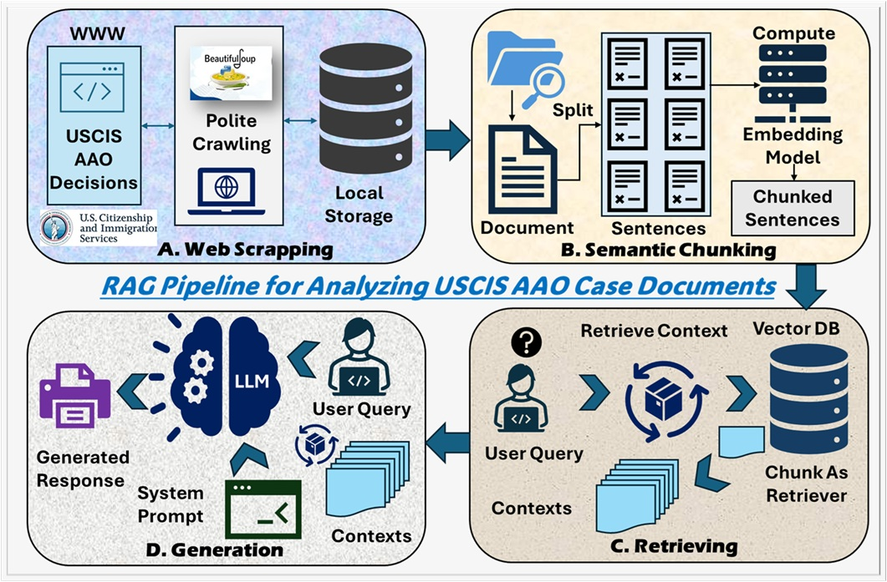

# NIW-NP-RAG

## Retrieval-Augmented Generation (RAG) Pipeline for Analyzing USCIS AAO Case Documents

This repository implements a **Retrieval-Augmented Generation (RAG)** system built to analyze **USCIS Administrative Appeals Office (AAO)** case PDFs — particularly for **National Interest Waiver (NIW)** petitions.  
The pipeline semantically indexes and retrieves case information to support data-driven insights and question answering over hundreds of past case decisions.

---

## Architecture



The architecture is a modular RAG pipeline designed for scalable, explainable analysis of AAO case PDFs. Data flows from raw documents to production APIs in discrete stages:

- Ingestion & Storage  
    - Batch or streaming PDF ingestion from local folders or cloud storage.  
    - Raw PDFs stored alongside extracted metadata for provenance.

- Text Extraction & Cleaning  
    - OCR (when needed) and PDF text extraction.  
    - Metadata normalization and noise removal (timestamps, producers, OCR artifacts).

- Preprocessing & Semantic Chunking  
    - Normalize text, remove boilerplate, and split into context-aware chunks (overlap-aware) using a SemanticChunker to preserve local coherence.

- Embedding & Vector Indexing  
    - Convert chunks to vector embeddings (configurable HF model).  
    - Store vectors in a FAISS index with persistent backing and incremental update support.

- Retrieval & Context Assembly  
    - Nearest-neighbor search (cosine similarity) fetches top-k chunks for a query.  
    - Optional reranking and context filtering to ensure relevance and token budget.

- LLM Reasoning & RAG Response  
    - Retrieved context is combined with the user query and passed to an LLM (e.g., Gemini 2.5 Flash via LangChain) to generate grounded, citation-aware answers.  
    - Response postprocessing adds traceability (chunk IDs, source PDF, page numbers).

## Overview

The RAG system combines **semantic chunking**, **vector embeddings**, and **context-aware LLM reasoning** to enable interactive querying of legal case data.  
It can answer analytical and statistical questions such as:

- “How many NIW cases were approved vs denied?”
- “What were the most common reasons for denial?”
- “Which supporting evidence was most persuasive in successful cases?”

---

## Key Features

- **📄 PDF Ingestion & Metadata Cleaning:**  
  Load multiple AAO case PDFs and clean metadata (creator, producer, timestamps).

- **🧹 Text Preprocessing:**  
  Normalize and structure extracted text to remove OCR noise and artifacts.

- **🧠 Semantic Chunking:**  
  Use Hugging Face embeddings with `SemanticChunker` to create contextually meaningful chunks rather than fixed-size splits.

- **📦 Vector Store (FAISS):**  
  Store and index embeddings in a **FAISS** database for fast semantic search.

- **🔍 Context Retrieval:**  
  Retrieve top-k relevant chunks using cosine similarity for each user query.

- **💬 RAG-Based Question Answering:**  
  Combine retrieved context with **Gemini 2.5 Flash** (or other LLMs via LangChain) to generate grounded, explainable answers.

- **📊 Statistical Insights (Extended Feature):**  
  Support structured aggregation queries (e.g., case counts, approval rates, denial trends) using the retrieved FAISS data.

- **🚀 Deployment-Ready Architecture:**  
  The project includes steps for deployment via **FastAPI** + **Uvicorn**, allowing external users to interact with the RAG system through an API endpoint.

---

<!-- ## Getting Started

1. **Clone this repository**
   ```bash
   git clone https://github.com/<your-username>/NIW-NP-RAG.git
   cd NIW-NP-RAG
   ```

2. **Install dependencies**
   ```bash
   pip install -r requirements.txt
   ``` -->